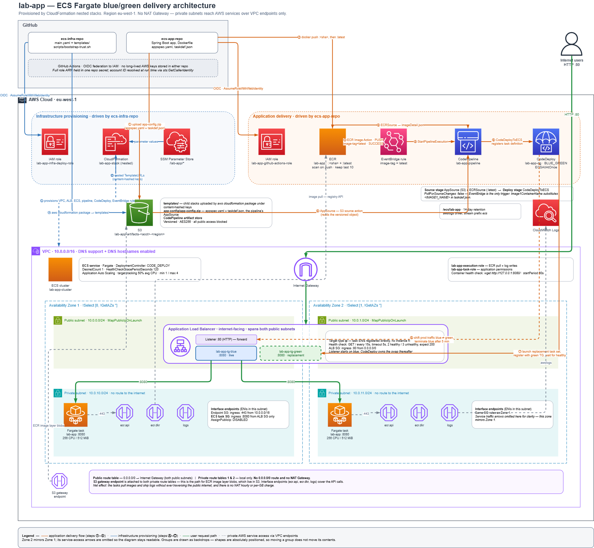

# Lab Guide: Highly Available, Blue/Green ECS Fargate Deployment with CloudFormation Nested Stacks + OIDC CI/CD

This guide walks through every step needed to satisfy the project's functional, technical, and rubric requirements. It's organized so you can work top-to-bottom and check off rubric items as you go.

---

## 0. Architecture Overview



Source: **[`docs/architecture.drawio`](docs/architecture.drawio)** 

### What the diagram shows

Read left to right, top to bottom:

- **Outside AWS** — the two GitHub repos and the Internet users hitting the ALB.
  **`ecs-infra-repo`** holds all the CloudFormation templates; **`ecs-app-repo`**
  holds the Java app, Dockerfile, `appspec.yaml` and `taskdef.json`.
- **Two CI/CD bands** — infrastructure provisioning (blue, stepped Ⓐ–Ⓒ, driven
  by `ecs-infra-repo`) and application delivery (orange, stepped ①–⑧, driven by
  `ecs-app-repo`). The orange numbers follow the order a single app commit
  travels the path; the two ⑤s are the pipeline's two source actions, which run
  in parallel.
- **The shared artifact bucket** in the middle, deliberately touched by both
  bands: `templates/` for the packaged nested stacks, `app-config/` for the
  pipeline's AppSource, plus CodePipeline's own artifact store.
- **The VPC** — two AZs, each with a public subnet (ALB only) and a private
  subnet (ECS tasks, VPC endpoints). The ALB is drawn *straddling* both public
  subnets because it is one load balancer with an ENI in each. The blue and green
  target groups sit inside the ALB band, since target groups are load-balancer
  constructs and not AZ-scoped.
- **The routing strip** at the bottom, which is where the no-NAT decision is
  visible: there is **no NAT Gateway**, the private route tables carry no
  `0.0.0.0/0` route at all, and the S3 gateway endpoint plus the three interface
  endpoints (`ecr.api`, `ecr.dkr`, `logs`) are the only egress. See §6.

Zone 2's service-access arrows are omitted — it mirrors Zone 1, and drawing both
sets made the middle of the diagram unreadable. Note also that the group boxes
are backdrops: every shape is absolutely positioned, so dragging a group in the
editor will not move its contents.

---

## 1. Prerequisites

- AWS account with admin access to bootstrap OIDC/roles once (afterward CI/CD uses least-privilege roles).
- Two GitHub repos created: `infra-repo`, `app-repo`.
- AWS CLI, Docker, and a Java toolchain (e.g., Java 21 + Maven or Spring Boot) installed locally for initial testing.
- Region chosen for the whole lab (e.g., `eu-west-1`) — use consistently everywhere.

---

## 2. Repository Layout

### `app-repo`
```
app-repo/
├── src/main/java/.../Application.java
├── src/main/resources/static/index.html
├── pom.xml
├── Dockerfile
├── appspec.yaml              # CodeDeploy ECS spec
├── taskdef.json              # ECS task definition template (used by CodeDeploy)
└── .github/workflows/build-and-push.yml
```

### `infra-repo`
```
infra-repo/
├── main.yaml                  # root/parent stack - sits one level ABOVE its children
├── templates/
│   ├── network.yaml           # VPC, subnets, routes, VPC endpoints (no NAT)
│   ├── security-groups.yaml
│   ├── ecs-cluster-service.yaml
│   ├── alb.yaml
│   ├── codepipeline-codedeploy.yaml
│   ├── eventbridge.yaml
│   │
│   │                          # standalone bootstrap stacks, not nested children:
│   ├── infra-deploy-role.yaml
│   ├── oidc-github.yaml
│   ├── artifact-bucket.yaml
│   ├── ecr.yaml
│   └── ssm-parameters.yaml
├── docs/
│   └── architecture.drawio    # diagram source (export to architecture.png, §19)
├── scripts/bootstrap-trust.sh
└── .github/workflows/deploy-infra.yaml
```

`main.yaml` lives at the root, above `templates/`, and refers to its children by
plain relative path (`templates/network.yaml`). Those paths are resolved by
`aws cloudformation package` at deploy time — see §12.

---

## 3. Step 1 — Application Code (Frontend Requirement)

Build a minimal Java web app (Spring Boot is simplest) that serves a static page.

**`src/main/resources/static/index.html`**
```html
<!DOCTYPE html>
<html>
<head><title>ECS Fargate Lab</title></head>
<body style="font-family: sans-serif; text-align:center; margin-top:100px;">
  <h1>Your Full Name</h1>
  <h2>Lab Name: ECS Fargate Blue/Green CI/CD Lab</h2>
</body>
</html>
```

Replace "Your Full Name" and confirm the lab name matches your assignment title. If using Spring Boot, this file under `src/main/resources/static/` is served automatically at `/`.

Add a `/health` endpoint (or rely on `/` for the ALB health check — Spring Boot serves static content at `/` with HTTP 200, which works fine as a health check target).

**`pom.xml`** — standard `spring-boot-starter-web` app packaged as an executable jar, exposing port 8080.

---

## 4. Step 2 — Dockerfile

```dockerfile
# ---- Build stage ----
FROM maven:3.9-eclipse-temurin-21 AS build
WORKDIR /app
COPY pom.xml .
COPY src ./src
RUN mvn -q clean package -DskipTests

# ---- Runtime stage ----
FROM eclipse-temurin:21-jre-alpine
WORKDIR /app
COPY --from=build /app/target/*.jar app.jar
EXPOSE 8080
ENTRYPOINT ["java", "-jar", "app.jar"]
```

Test locally:
```bash
docker build -t lab-app:local .
docker run -p 8080:8080 lab-app:local
curl http://localhost:8080
```

---

## 5. Step 3 — OIDC Trust Between GitHub and AWS

This removes the need for long-lived AWS access keys in GitHub Actions.

**`templates/oidc-github.yaml`** (deploy this first, or as part of `main.yaml`):

```yaml
Parameters:
  GitHubOrg:
    Type: String
  AppRepoName:
    Type: String

Resources:
  GitHubOIDCProvider:
    Type: AWS::IAM::OIDCProvider
    Properties:
      Url: https://token.actions.githubusercontent.com
      ClientIdList:
        - sts.amazonaws.com
      ThumbprintList:
        - 6938fd4d98bab03faadb97b34396831e3780aea1

  GitHubActionsRole:
    Type: AWS::IAM::Role
    Properties:
      RoleName: github-actions-ecr-push-role
      AssumeRolePolicyDocument:
        Version: "2012-10-17"
        Statement:
          - Effect: Allow
            Principal:
              Federated: !Ref GitHubOIDCProvider
            Action: sts:AssumeRoleWithWebIdentity
            Condition:
              StringEquals:
                token.actions.githubusercontent.com:aud: sts.amazonaws.com
              StringLike:
                token.actions.githubusercontent.com:sub: !Sub "repo:${GitHubOrg}/${AppRepoName}:ref:refs/heads/main"
      Policies:
        - PolicyName: ecr-push
          PolicyDocument:
            Version: "2012-10-17"
            Statement:
              - Effect: Allow
                Action:
                  - ecr:GetAuthorizationToken
                Resource: "*"
              - Effect: Allow
                Action:
                  - ecr:BatchCheckLayerAvailability
                  - ecr:PutImage
                  - ecr:InitiateLayerUpload
                  - ecr:UploadLayerPart
                  - ecr:CompleteLayerUpload
                Resource: !GetAtt ECRRepository.Arn
```

> Rubric hit: **OIDC used for AWS authentication (10 pts)**. Scope the trust policy's `sub` condition tightly to your repo and branch — this satisfies least-privilege.

---

## 6. Step 4 — Networking (Multi-AZ VPC)

**`templates/network.yaml`** highlights:

- 1 VPC (e.g., `10.0.0.0/16`)
- 2 public subnets (one per AZ), 2 private subnets (one per AZ)
- 1 Internet Gateway attached to the VPC
- **No NAT Gateway.** A NAT would carry the ECR pull and the CloudWatch Logs
  writes out over the public internet (and bill per NAT-hour plus per GB) just
  to reach AWS services that are already reachable privately. The private route
  tables therefore have **no `0.0.0.0/0` route at all** — private subnets have
  no egress path to the internet, and the VPC endpoints below carry everything
  the tasks need. If a future task needs an AWS API not listed below, add an
  interface endpoint for it rather than reintroducing the NAT.
- Route tables: public subnets → IGW; private subnets → local + S3 gateway endpoint only
- **VPC Endpoints** (Interface type, in private subnets) for:
  - `com.amazonaws.<region>.ecr.api`
  - `com.amazonaws.<region>.ecr.dkr`
  - `com.amazonaws.<region>.logs` (CloudWatch Logs)
  - `com.amazonaws.<region>.s3` (Gateway endpoint — required because ECR image layers are stored in S3)
  - Optionally `com.amazonaws.<region>.secretsmanager` if you add secrets later

```yaml
  ECRApiEndpoint:
    Type: AWS::EC2::VPCEndpoint
    Properties:
      VpcId: !Ref VPC
      ServiceName: !Sub com.amazonaws.${AWS::Region}.ecr.api
      VpcEndpointType: Interface
      SubnetIds: [!Ref PrivateSubnet1, !Ref PrivateSubnet2]
      SecurityGroupIds: [!Ref VPCEndpointSecurityGroup]
      PrivateDnsEnabled: true

  ECRDkrEndpoint:
    Type: AWS::EC2::VPCEndpoint
    Properties:
      VpcId: !Ref VPC
      ServiceName: !Sub com.amazonaws.${AWS::Region}.ecr.dkr
      VpcEndpointType: Interface
      SubnetIds: [!Ref PrivateSubnet1, !Ref PrivateSubnet2]
      SecurityGroupIds: [!Ref VPCEndpointSecurityGroup]
      PrivateDnsEnabled: true

  LogsEndpoint:
    Type: AWS::EC2::VPCEndpoint
    Properties:
      VpcId: !Ref VPC
      ServiceName: !Sub com.amazonaws.${AWS::Region}.logs
      VpcEndpointType: Interface
      SubnetIds: [!Ref PrivateSubnet1, !Ref PrivateSubnet2]
      SecurityGroupIds: [!Ref VPCEndpointSecurityGroup]
      PrivateDnsEnabled: true

  S3GatewayEndpoint:
    Type: AWS::EC2::VPCEndpoint
    Properties:
      VpcId: !Ref VPC
      ServiceName: !Sub com.amazonaws.${AWS::Region}.s3
      VpcEndpointType: Gateway
      RouteTableIds: [!Ref PrivateRouteTable1, !Ref PrivateRouteTable2]
```

> Rubric hit: **Multi-AZ VPC (10 pts)**, **Private ECS tasks with VPC Endpoint connectivity (10 pts)**.

---

## 7. Step 5 — Security Groups (Least Privilege)

**`templates/security-groups.yaml`**:

- **ALB SG**: Inbound 80/443 from `0.0.0.0/0`. Outbound to ECS SG only (or all, restricted to task port).
- **ECS Tasks SG**: Inbound on container port (e.g., 8080) **only from ALB SG** (not from `0.0.0.0/0`). No inbound from the internet — tasks are private.
- **VPC Endpoint SG**: Inbound 443 **only from ECS Tasks SG**.

```yaml
  ALBSecurityGroup:
    Type: AWS::EC2::SecurityGroup
    Properties:
      GroupDescription: ALB SG - public HTTP/HTTPS
      VpcId: !Ref VPC
      SecurityGroupIngress:
        - IpProtocol: tcp
          FromPort: 80
          ToPort: 80
          CidrIp: 0.0.0.0/0

  ECSTaskSecurityGroup:
    Type: AWS::EC2::SecurityGroup
    Properties:
      GroupDescription: ECS tasks - only from ALB
      VpcId: !Ref VPC
      SecurityGroupIngress:
        - IpProtocol: tcp
          FromPort: 8080
          ToPort: 8080
          SourceSecurityGroupId: !Ref ALBSecurityGroup

  VPCEndpointSecurityGroup:
    Type: AWS::EC2::SecurityGroup
    Properties:
      GroupDescription: VPC endpoints - only from ECS tasks
      VpcId: !Ref VPC
      SecurityGroupIngress:
        - IpProtocol: tcp
          FromPort: 443
          ToPort: 443
          SourceSecurityGroupId: !Ref ECSTaskSecurityGroup
```

> Rubric hit: **Security groups follow least-privilege (10 pts)**.

---

## 8. Step 6 — ECR Repository

**`templates/ecr.yaml`**:

```yaml
  ECRRepository:
    Type: AWS::ECR::Repository
    Properties:
      RepositoryName: lab-app
      ImageTagMutability: MUTABLE
      ImageScanningConfiguration:
        ScanOnPush: true
      LifecyclePolicy:
        LifecyclePolicyText: |
          {
            "rules": [{
              "rulePriority": 1,
              "description": "Keep last 10 images",
              "selection": { "tagStatus": "any", "countType": "imageCountMoreThan", "countNumber": 10 },
              "action": { "type": "expire" }
            }]
          }
```

**Tagging strategy** (rubric asks for "consistent and mutable"): tag every image with the Git SHA **and** move a `latest` (or `stable`) tag to point at it, e.g., in GitHub Actions:
```bash
docker tag lab-app:$GITHUB_SHA <account>.dkr.ecr.<region>.amazonaws.com/lab-app:$GITHUB_SHA
docker tag lab-app:$GITHUB_SHA <account>.dkr.ecr.<region>.amazonaws.com/lab-app:latest
docker push <account>.dkr.ecr.<region>.amazonaws.com/lab-app:$GITHUB_SHA
docker push <account>.dkr.ecr.<region>.amazonaws.com/lab-app:latest
```
Keep `ImageTagMutability: MUTABLE` so `latest` can be overwritten — this is what "consistent and mutable" is asking for, while the SHA tag gives you an immutable audit trail per build.

> Rubric hit: **Image tagging strategy consistent and mutable (5 pts)**.

---

## 9. Step 7 — ALB, Target Groups (Blue/Green pair), Listener

**`templates/alb.yaml`**:

- 1 ALB in the two **public** subnets, SG = ALB SG.
- **Two target groups** (`tg-blue`, `tg-green`) — CodeDeploy needs two target groups to shift traffic between.
- 1 listener on port 80 forwarding to `tg-blue` initially (CodeDeploy will manage the swap).
- Health check path `/`, healthy threshold 2, interval 15s.

```yaml
  ALB:
    Type: AWS::ElasticLoadBalancingV2::LoadBalancer
    Properties:
      Scheme: internet-facing
      Subnets: [!Ref PublicSubnet1, !Ref PublicSubnet2]
      SecurityGroups: [!Ref ALBSecurityGroup]

  TargetGroupBlue:
    Type: AWS::ElasticLoadBalancingV2::TargetGroup
    Properties:
      Port: 8080
      Protocol: HTTP
      TargetType: ip
      VpcId: !Ref VPC
      HealthCheckPath: /
      HealthCheckIntervalSeconds: 15
      HealthyThresholdCount: 2

  TargetGroupGreen:
    Type: AWS::ElasticLoadBalancingV2::TargetGroup
    Properties:
      Port: 8080
      Protocol: HTTP
      TargetType: ip
      VpcId: !Ref VPC
      HealthCheckPath: /
      HealthCheckIntervalSeconds: 15
      HealthyThresholdCount: 2

  Listener:
    Type: AWS::ElasticLoadBalancingV2::Listener
    Properties:
      LoadBalancerArn: !Ref ALB
      Port: 80
      Protocol: HTTP
      DefaultActions:
        - Type: forward
          TargetGroupArn: !Ref TargetGroupBlue
```

> Rubric hit: **Public ALB architecture (part of the 10 pts above)**, **Application accessible via ALB (5 pts)**, **ECS tasks pass ALB health checks (5 pts)**.

---

## 10. Step 8 — ECS Cluster, Task Definition, Service (CodeDeploy-controlled)

**`templates/ecs-cluster-service.yaml`**:

- Fargate cluster.
- Task execution role (pull from ECR, write logs) and task role (app permissions, minimal/none).
- Task definition: container port 8080, `awslogs` log driver pointing to a CloudWatch Logs group.
- Service:
  - `LaunchType: FARGATE`
  - `NetworkConfiguration`: private subnets, `AssignPublicIp: DISABLED`, SG = ECS Task SG.
  - `DeploymentController.Type: CODE_DEPLOY` (critical — this hands blue/green traffic-shifting to CodeDeploy instead of ECS's native rolling update).
  - `DesiredCount: 1`.

```yaml
  ECSCluster:
    Type: AWS::ECS::Cluster
    Properties:
      ClusterName: lab-app-cluster

  LogGroup:
    Type: AWS::Logs::LogGroup
    Properties:
      LogGroupName: /ecs/lab-app
      RetentionInDays: 14

  TaskDefinition:
    Type: AWS::ECS::TaskDefinition
    Properties:
      Family: lab-app
      Cpu: "256"
      Memory: "512"
      NetworkMode: awsvpc
      RequiresCompatibilities: [FARGATE]
      ExecutionRoleArn: !GetAtt ExecutionRole.Arn
      TaskRoleArn: !GetAtt TaskRole.Arn
      ContainerDefinitions:
        - Name: lab-app
          Image: !Sub "${ECRRepositoryUri}:latest"
          PortMappings:
            - ContainerPort: 8080
          LogConfiguration:
            LogDriver: awslogs
            Options:
              awslogs-group: !Ref LogGroup
              awslogs-region: !Ref AWS::Region
              awslogs-stream-prefix: ecs

  ECSService:
    Type: AWS::ECS::Service
    Properties:
      Cluster: !Ref ECSCluster
      DesiredCount: 1
      LaunchType: FARGATE
      TaskDefinition: !Ref TaskDefinition
      DeploymentController:
        Type: CODE_DEPLOY
      NetworkConfiguration:
        AwsvpcConfiguration:
          Subnets: [!Ref PrivateSubnet1, !Ref PrivateSubnet2]
          SecurityGroups: [!Ref ECSTaskSecurityGroup]
          AssignPublicIp: DISABLED
      LoadBalancers:
        - ContainerName: lab-app
          ContainerPort: 8080
          TargetGroupArn: !Ref TargetGroupBlue
```

> Rubric hit: **ECS logs visible in CloudWatch Logs (5 pts)**.

### Auto Scaling (min 1 / desired 1 / max 4, CPU-based)

```yaml
  ScalableTarget:
    Type: AWS::ApplicationAutoScaling::ScalableTarget
    Properties:
      ServiceNamespace: ecs
      ResourceId: !Sub service/${ECSCluster}/${ECSService.Name}
      ScalableDimension: ecs:service:DesiredCount
      MinCapacity: 1
      MaxCapacity: 4
      RoleARN: !Sub arn:aws:iam::${AWS::AccountId}:role/aws-service-role/ecs.application-autoscaling.amazonaws.com/AWSServiceRoleForApplicationAutoScaling_ECSService

  CPUScalingPolicy:
    Type: AWS::ApplicationAutoScaling::ScalingPolicy
    Properties:
      PolicyName: cpu-target-tracking
      PolicyType: TargetTrackingScaling
      ScalingTargetId: !Ref ScalableTarget
      TargetTrackingScalingPolicyConfiguration:
        TargetValue: 50.0
        PredefinedMetricSpecification:
          PredefinedMetricType: ECSServiceAverageCPUUtilization
        ScaleInCooldown: 60
        ScaleOutCooldown: 60
```

> Rubric hit: **Auto Scaling configured correctly (5 pts)**.

---

## 11. Step 9 — CodeDeploy Application + Deployment Group (ECS Blue/Green)

**`templates/codepipeline-codedeploy.yaml`** (part 1):

```yaml
  CodeDeployApplication:
    Type: AWS::CodeDeploy::Application
    Properties:
      ComputePlatform: ECS

  CodeDeployDeploymentGroup:
    Type: AWS::CodeDeploy::DeploymentGroup
    Properties:
      ApplicationName: !Ref CodeDeployApplication
      DeploymentGroupName: lab-app-dg
      ServiceRoleArn: !GetAtt CodeDeployServiceRole.Arn
      DeploymentConfigName: CodeDeployDefault.ECSAllAtOnce
      DeploymentStyle:
        DeploymentType: BLUE_GREEN
        DeploymentOption: WITH_TRAFFIC_CONTROL
      BlueGreenDeploymentConfiguration:
        TerminateBlueInstancesOnDeploymentSuccess:
          Action: TERMINATE
          TerminationWaitTimeInMinutes: 5
        DeploymentReadyOption:
          ActionOnTimeout: CONTINUE_DEPLOYMENT
      LoadBalancerInfo:
        TargetGroupPairInfoList:
          - ProdTrafficRoute:
              ListenerArns: [!Ref Listener]
            TargetGroups:
              - Name: !GetAtt TargetGroupBlue.TargetGroupName
              - Name: !GetAtt TargetGroupGreen.TargetGroupName
      ECSServices:
        - ServiceName: !GetAtt ECSService.Name
          ClusterName: !Ref ECSCluster
```

App repo needs `appspec.yaml` (drives CodeDeploy's ECS blue/green swap):
```yaml
version: 0.0
Resources:
  - TargetService:
      Type: AWS::ECS::Service
      Properties:
        TaskDefinition: <TASK_DEFINITION>
        LoadBalancerInfo:
          ContainerName: "lab-app"
          ContainerPort: 8080
```
(`<TASK_DEFINITION>` is substituted by CodePipeline's Deploy action at runtime with the newly registered task definition ARN.)

> Rubric hit: **Blue/green deployment functions correctly (5 pts)**.

---

## 12. Step 10 — S3 Bucket for Nested Templates + Pipeline Artifacts

```yaml
  ArtifactBucket:
    Type: AWS::S3::Bucket
    Properties:
      BucketName: !Sub lab-app-artifacts-${AWS::AccountId}-${AWS::Region}
      VersioningConfiguration:
        Status: Enabled
      BucketEncryption:
        ServerSideEncryptionConfiguration:
          - ServerSideEncryptionByDefault:
              SSEAlgorithm: AES256
      PublicAccessBlockConfiguration:
        BlockPublicAcls: true
        BlockPublicPolicy: true
        IgnorePublicAcls: true
        RestrictPublicBuckets: true
```

Nested child templates are **not** uploaded by hand. `main.yaml` references them
by local relative path:

```yaml
  NetworkStack:
    Type: AWS::CloudFormation::Stack
    Properties:
      TemplateURL: templates/network.yaml
```

and `aws cloudformation package` resolves those paths — uploading each child to
the artifact bucket and rewriting the URLs into a new template — right before
the deploy:

```bash
aws cloudformation package \
  --template-file main.yaml \
  --s3-bucket lab-app-artifacts-<account>-<region> \
  --s3-prefix templates \
  --output-template-file packaged-main.yaml

aws cloudformation deploy \
  --stack-name lab-app-stack \
  --template-file packaged-main.yaml \
  --capabilities CAPABILITY_NAMED_IAM \
  --no-fail-on-empty-changeset
```

Why this instead of an `aws s3 sync templates/` step: `package` derives the S3
keys from the **content hash** of each child template, so the deployed nested
stack is always the template that is in the commit being deployed. A hand-rolled
sync can silently half-succeed and leave `main.yaml` pointing at a stale child,
and a fixed key like `templates/network.yaml` gives no signal that the object
behind it changed.

> Note: these relative paths are why CloudFormation Git sync is not used for
> `lab-app-stack` — Git sync never runs `package`, so it cannot resolve them.
> The GitHub Actions workflow is the single owner of this stack. See §16.

---

## 13. Step 11 — CodePipeline (Source = ECR via EventBridge, Deploy = CodeDeploy)

```yaml
  Pipeline:
    Type: AWS::CodePipeline::Pipeline
    Properties:
      RoleArn: !GetAtt PipelineServiceRole.Arn
      ArtifactStore:
        Type: S3
        Location: !Ref ArtifactBucket
      Stages:
        - Name: Source
          Actions:
            # AppSource: appspec.yaml + taskdef.json, read from the artifact
            # bucket. The app repo's workflow uploads them (see §15) - the
            # pipeline does NOT check the repo out over CodeConnections.
            - Name: AppSource
              ActionTypeId:
                Category: Source
                Owner: AWS
                Provider: S3
                Version: "1"
              Configuration:
                S3Bucket: !Ref ArtifactBucketName
                S3ObjectKey: app-config/app-config.zip
                PollForSourceChanges: false
              OutputArtifacts: [Name: AppSource]
            # ECRSource: imageDetail.json, i.e. the URI of the pushed image
            - Name: ECRSource
              ActionTypeId:
                Category: Source
                Owner: AWS
                Provider: ECR
                Version: "1"
              Configuration:
                RepositoryName: !Ref ECRRepository
                ImageTag: latest
              OutputArtifacts: [Name: ImageDetail]
        - Name: Deploy
          Actions:
            - Name: DeployToECS
              ActionTypeId:
                Category: Deploy
                Owner: AWS
                Provider: CodeDeployToECS
                Version: "1"
              Configuration:
                ApplicationName: !Ref CodeDeployApplication
                DeploymentGroupName: !Ref CodeDeployDeploymentGroup
                TaskDefinitionTemplateArtifact: AppSource
                TaskDefinitionTemplatePath: taskdef.json
                AppSpecTemplateArtifact: AppSource
                AppSpecTemplatePath: appspec.yaml
                Image1ArtifactName: ImageDetail
                Image1ContainerName: IMAGE1_NAME
              InputArtifacts:
                - Name: AppSource
                - Name: ImageDetail
```

**Why S3 and not a CodeStar/CodeConnections source for `AppSource`:** the two
files the deploy needs are build *outputs* of the app pipeline, and the app
repo's workflow is already authenticated to AWS via OIDC when it produces them.
Publishing them to the artifact bucket keeps the deploy reading from one place
(the bucket) instead of two (the bucket for the image detail, GitHub for the
config), removes the pipeline's dependency on a CodeConnections link and its
`codeconnections:UseConnection` grant, and means the config artifact is
versioned in the same bucket as everything else the deploy consumes.

The pipeline role needs `s3:GetObjectVersion` for this — the S3 source action
reads a specific object version, not just the current one.

> Note: the ECR source action alone only reacts if you also enable/rely on the CloudWatch Events integration; the requirement explicitly wants **EventBridge** to trigger the pipeline, so build the EventBridge rule explicitly in the next step for a clean, visible trigger (and don't rely solely on the built-in polling).

---

## 14. Step 12 — EventBridge Rule: ECR Push → CodePipeline

**`templates/eventbridge.yaml`**:

```yaml
  ECRPushRule:
    Type: AWS::Events::Rule
    Properties:
      Description: Trigger pipeline on new image push to ECR
      EventPattern:
        source: ["aws.ecr"]
        detail-type: ["ECR Image Action"]
        detail:
          action-type: ["PUSH"]
          repository-name: [!Ref ECRRepository]
          image-tag: ["latest"]      # <-- not "any successful push"
          result: ["SUCCESS"]
      Targets:
        - Arn: !Sub arn:aws:codepipeline:${AWS::Region}:${AWS::AccountId}:${Pipeline}
          Id: CodePipelineTarget
          RoleArn: !GetAtt EventBridgeInvokePipelineRole.Arn

  EventBridgeInvokePipelineRole:
    Type: AWS::IAM::Role
    Properties:
      AssumeRolePolicyDocument:
        Version: "2012-10-17"
        Statement:
          - Effect: Allow
            Principal: { Service: events.amazonaws.com }
            Action: sts:AssumeRole
      Policies:
        - PolicyName: start-pipeline
          PolicyDocument:
            Version: "2012-10-17"
            Statement:
              - Effect: Allow
                Action: codepipeline:StartPipelineExecution
                Resource: !Sub arn:aws:codepipeline:${AWS::Region}:${AWS::AccountId}:${Pipeline}
```

**The `image-tag` filter matters.** Every build publishes the same image under
two tags — the commit SHA and `latest` — and that is deliberate (§8): the SHA tag
is the immutable audit trail and the thing you roll back to, `latest` is the
mutable pointer the pipeline follows. They cannot be collapsed into one push:
OCI tags are separate manifest references, so `docker push` issues one manifest
PUT per tag (`buildx --tag a --tag b --push` included) and ECR emits one `PUSH`
event per tag regardless of how the command is shaped.

So the rule has to do the disambiguating. Matching on `action-type: PUSH` +
`result: SUCCESS` alone matches *both* events, which started the pipeline twice
per build — and the SHA-tag event arrives first, while `latest` still points at
the previous image, so that first execution could deploy the *old* build. The
pipeline's ECR source action resolves `latest`, so `latest` is the only push
worth reacting to. Push it last in the workflow (§15) and filter on it here.

> Rubric hit: this is the core mechanism tying "GitHub Actions builds image → EventBridge → CodePipeline → CodeDeploy blue/green" together.

---

## 15. Step 13 — GitHub Actions Workflow (OIDC → Build → Push)

**`.github/workflows/build-and-push.yml`** in `app-repo`:

```yaml
name: Build and Push to ECR

on:
  push:
    branches: [main]

permissions:
  id-token: write   # required for OIDC
  contents: read

env:
  AWS_REGION: eu-west-1
  ECR_REPOSITORY: lab-app
  APP_CONFIG_KEY: app-config/app-config.zip

jobs:
  build-push:
    runs-on: ubuntu-latest
    steps:
      - uses: actions/checkout@v4

      # One secret holds the WHOLE role ARN. The account ID is not a repo
      # variable - see the note below.
      - name: Configure AWS credentials via OIDC
        uses: aws-actions/configure-aws-credentials@v4
        with:
          role-to-assume: ${{ secrets.AWS_GITHUB_ACTIONS_ROLE_ARN }}
          aws-region: ${{ env.AWS_REGION }}

      - name: Resolve artifact bucket
        run: |
          ACCOUNT_ID="$(aws sts get-caller-identity --query Account --output text)"
          echo "ARTIFACT_BUCKET=lab-app-artifacts-${ACCOUNT_ID}-${AWS_REGION}" >> "$GITHUB_ENV"

      - name: Login to ECR
        id: ecr-login
        uses: aws-actions/amazon-ecr-login@v2

      - name: Build and tag image
        env:
          REGISTRY: ${{ steps.ecr-login.outputs.registry }}
          IMAGE_TAG: ${{ github.sha }}
        run: |
          docker build -t "$REGISTRY/$ECR_REPOSITORY:$IMAGE_TAG" .
          docker tag "$REGISTRY/$ECR_REPOSITORY:$IMAGE_TAG" "$REGISTRY/$ECR_REPOSITORY:latest"

      # Publishes the deploy config the pipeline's AppSource action reads (§13).
      # Must happen BEFORE the :latest push, which is what fires EventBridge.
      - name: Upload appspec and task definition to artifact bucket
        run: |
          zip -j app-config.zip appspec.yaml taskdef.json
          aws s3 cp app-config.zip "s3://${ARTIFACT_BUCKET}/${APP_CONFIG_KEY}"

      - name: Push image
        env:
          REGISTRY: ${{ steps.ecr-login.outputs.registry }}
          IMAGE_TAG: ${{ github.sha }}
        run: |
          docker push "$REGISTRY/$ECR_REPOSITORY:$IMAGE_TAG"
          docker push "$REGISTRY/$ECR_REPOSITORY:latest"   # fires the pipeline
```

**Step order is load-bearing.** The `:latest` push is the pipeline trigger, and
the pipeline immediately reads `app-config.zip` for `appspec.yaml` and
`taskdef.json`. Uploading the zip *after* the push would race the deployment and
could deploy this commit's image against the previous commit's task definition.
Upload first, push last.

**Role ARN as a secret, not an assembled string.** Both workflows take the full
role ARN from a single secret (`AWS_GITHUB_ACTIONS_ROLE_ARN` here,
`AWS_INFRA_DEPLOY_ROLE_ARN` in the infra repo) rather than interpolating an
`AWS_ACCOUNT_ID` repo variable into an ARN template. Two reasons: the account ID
stops being published in plaintext in workflow logs and repo settings, and the
ARN stops being reassembled in several places that can drift out of sync with the
role's real name. Where the account ID is genuinely needed afterwards — here, to
name the artifact bucket — it is read back from the assumed session with
`sts get-caller-identity`, which needs no extra IAM grant and cannot disagree
with the role that was actually assumed.

> Rubric hit: **GitHub Actions builds container image successfully (5 pts)**, **Image pushed to ECR (5 pts)**, **OIDC used for AWS authentication (10 pts)**.

---

## 16. Step 14 — Git-Driven Deployment (why not CloudFormation Git sync)

Every push to `main` in `infra-repo` redeploys the whole stack, with no manual
`aws cloudformation deploy` and nothing clicked in the console. That is handled by
[`.github/workflows/deploy-infra.yaml`](.github/workflows/deploy-infra.yaml), not
by CloudFormation Git sync. Git sync was evaluated and deliberately dropped.

**Why.** Git sync deploys the template file exactly as it appears in the commit —
it never runs `aws cloudformation package`. Since `main.yaml` references its
children by relative path (`templates/network.yaml`), Git sync cannot resolve
them and the deploy fails. Keeping both would also mean two systems racing to own
the same stack. The options were:

| Option | Cost |
|---|---|
| Workflow owns the stack (**chosen**) | Loses the literal "Git sync" mechanism |
| Commit the `package` output and point Git sync at it | A generated file in git, and the workflow still has to run first |
| Hardcode S3 `TemplateURL`s and drop `package` | Back to hand-maintaining template uploads, with stale-copy risk |

The first option keeps one owner per stack and keeps the nested templates
content-addressed. The `lab-app-gitsync-deployment-file.yaml` that used to sit in
the repo root has been deleted, since nothing read it.

**What you get instead** — the same properties the rubric is really asking for:

- Push to `main` → stack updates automatically, no console steps.
- Every resource (VPC, SGs, ECR, ALB, ECS, pipeline, CodeDeploy, EventBridge,
  artifact bucket, IAM roles) is declared in these templates. Nothing is created
  by hand except the one-time OIDC trust in `scripts/bootstrap-trust.sh`.
- Auth is OIDC — no stored AWS credentials anywhere.

> **Rubric note:** if the marker requires CloudFormation Git sync *specifically*
> rather than "all resources provisioned via CloudFormation, deployed from git",
> take option 2 above — have the workflow commit `packaged-main.yaml` and point a
> Git sync deployment file at that. Worth confirming which reading applies before
> submitting.

---

## 17. Step 15 — Deploy Order (First-Time Bootstrap)

Because of chicken-and-egg dependencies (ECR must exist before the first image push; the pipeline needs an image to exist before its first successful run), deploy in this order:

1. `oidc-github.yaml` (or include first in `main.yaml`) → creates OIDC provider + GitHub Actions role.
2. `network.yaml` → VPC/subnets/endpoints.
3. `security-groups.yaml`.
4. `ecr.yaml`.
5. Push app code once via GitHub Actions → confirms image lands in ECR with tag `latest`.
6. `alb.yaml`, `ecs-cluster-service.yaml` (task def references the now-existing `:latest` image), `codepipeline-codedeploy.yaml`, `eventbridge.yaml`.
7. Confirm ECS service reaches steady state and ALB target group shows healthy targets.
8. Push a code change → GitHub Actions builds new image → EventBridge fires → CodePipeline runs → CodeDeploy blue/green swap executes → verify old (blue) tasks drain and new (green) tasks serve traffic.

The workflow already expresses this as one `main.yaml` nested-stack deploy, so in practice you only need to make sure an image exists in ECR before the very first run of the main stack — the task definition needs a real image URI to be valid. Push the app once (step 5) and the rest follows.

---

## 18. Step 16 — Validation Checklist (map directly to rubric)

| Check | How to verify |
|---|---|
| Multi-AZ VPC | Console → VPC → confirm subnets span 2 AZs |
| Private ECS tasks | ECS service → Networking → `AssignPublicIp: DISABLED`, subnets are private |
| VPC Endpoint connectivity | Task launches and pulls its image with no NAT and no public IP; `aws ec2 describe-route-tables` shows no `0.0.0.0/0` route on either private route table |
| Nested templates packaged | Workflow's "Package nested templates" step succeeds; `aws s3 ls s3://<bucket>/templates/` shows content-hashed keys, and `lab-app-stack`'s nested stacks point at them |
| AppSource from S3 | `aws s3 ls s3://<bucket>/app-config/` shows `app-config.zip` updated at the time of the last app-repo build; pipeline's AppSource action shows provider `S3` |
| EventBridge fires once | One pipeline execution per app-repo push, not two — `aws codepipeline list-pipeline-executions --pipeline-name lab-app-pipeline` |
| SG least privilege | Inspect each SG's inbound rules — no `0.0.0.0/0` except the ALB |
| Git-driven deploy | Push a trivial infra change, confirm the Deploy Infrastructure workflow runs and `lab-app-stack` updates in the CFN console |
| GitHub Actions build | Push to `app-repo`, check Actions tab succeeds |
| Image in ECR | `aws ecr describe-images --repository-name lab-app` |
| OIDC | Confirm no AWS access key secrets exist in `app-repo` GitHub secrets |
| Tagging strategy | Each image has a SHA tag + `latest` |
| ALB reachable | `curl http://<alb-dns-name>` returns your name + lab name |
| ALB health checks | Target group → Targets tab → status `healthy` |
| CloudWatch Logs | `/ecs/lab-app` log group has recent streams |
| Auto Scaling | `aws application-autoscaling describe-scaling-policies` shows target-tracking on CPU, min 1 / max 4 |
| Blue/green works | Push new image, watch CodeDeploy console show a blue/green deployment progress and complete |

---

## 19. Step 17 — Network Architecture Diagram

The diagram is rendered at the top of this guide (§0), which also explains what
it shows and why the ALB and target groups are drawn where they are. Its source
is **[`docs/architecture.drawio`](docs/architecture.drawio)**; this section is
only about producing and refreshing the `docs/architecture.png` that §0 embeds.

### Exporting the image

1. Open [app.diagrams.net](https://app.diagrams.net) → **File → Open From → Device**
   and pick `docs/architecture.drawio`. It uses only the built-in AWS 2019
   (`mxgraph.aws4`) shape library, so there is nothing to enable first.
2. **File → Export as → PNG**, with **Zoom 200%**, **Transparent Background off**,
   and **Selection Only off**.
3. Save it as `docs/architecture.png` and commit it next to the source.

Prefer SVG (sharper, much smaller) if you don't need PNG for a slide deck —
export as SVG, tick **Include a copy of my diagram** so the file stays editable,
save as `docs/architecture.svg`, and update the image link in §0 to match.

### Keeping it honest

Every label in the diagram is taken from the templates — subnet CIDRs, port
numbers, target-group names, health-check thresholds, IAM role names, pipeline
action providers — so it goes stale the moment they diverge. If you change any of
those, re-open the source, fix the label, and re-export. A diagram that
disagrees with the YAML is worse than no diagram.

One editing note: the group boxes are backdrops. Every shape is absolutely
positioned, so dragging a group in the editor will not move its contents.

> Rubric hit: **Network architecture diagram** deliverable.

---

## 20. Extra Credit — Tagging & Cost/Security Best Practices

- Add a common `Tags` block (e.g., `Project: ecs-fargate-lab`, `Environment: dev`, `Owner: <your name>`) to every resource that supports `Tags`, or set **stack-level tags** on `main.yaml` so CloudFormation propagates them to all supported child resources.
- Cost: the NAT Gateway is gone entirely, which is the single largest saving here — no NAT-hour charge, no per-GB processing on the ECR pull, and no Elastic IP. The interface endpoints do carry their own hourly + per-GB charge, but for a workload whose only egress is to ECR, S3, and CloudWatch Logs they come out cheaper than a NAT and keep the traffic off the public internet as well. Also consider Fargate Spot for non-critical scaling capacity, and the ECR lifecycle policy (already added above) to avoid unbounded image storage cost.
- Security: enable ECR image scanning (already set `ScanOnPush: true`), enable S3 bucket encryption + block public access (already set), restrict the GitHub OIDC trust policy's `sub` claim to the exact repo/branch, avoid `AdministratorAccess` on any pipeline/service role — scope IAM policies to only the actions listed above.

---

## 21. Deliverables Checklist

- [ ] `infra-repo` link — CloudFormation templates, deployed on every push by the Deploy Infrastructure workflow (§16).
- [ ] `app-repo` link — Java source, Dockerfile, `appspec.yaml`, `taskdef.json`, GitHub Actions workflow.
- [ ] ALB DNS name (from `aws elbv2 describe-load-balancers` or the CFN stack outputs).
- [x] Architecture diagram source — [`docs/architecture.drawio`](docs/architecture.drawio), committed to `infra-repo`.
- [ ] Architecture diagram export — `docs/architecture.png` (or `.svg`), committed alongside the source. See §19.